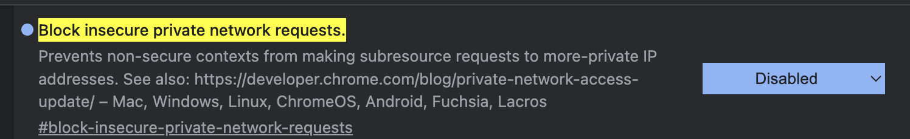
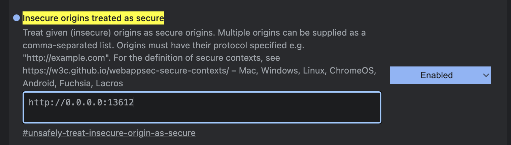

# Tomato management

## Source code explain
```
.
├── README.md
├── api                         # Main API Code
│   ├── app.py                  # Main app, define API endpoint
│   ├── data_model.py           # Request model
│   ├── helper.py               # Convert function
│   ├── model                   # Code to load AI model
│   ├── requirements.txt        # Dependecies
│   ├── thread.py               # Multi-thread helper
│   └── weights                 # Weights for all model
└── ui
    └── ai
        ├── assets              # Image and icon
        ├── cam_stream.html     # Camera screen
        ├── dashboard.html      # Dashboard screen
        ├── single_image.html   # Image upload screen
        ├── single_result.html  # Image upload result screen
        ├── scripts
        │   ├── services.js     # Script to call api
        │   └── utils.js        # Other helper
        ├── style
        │   ├── camera.css
        │   ├── dashboard.css
        │   ├── single.css
        │   └── singleResult.css
        └── template
            ├── footer.html
            └── header.html 
```


## Setup

### API
```
cd api
```

1. Create a python environments
2. Install deps
```
pip install -r requirements.txt

3. 
```
`https://drive.google.com/u/0/uc?id=1mmeuWNCHBBapTYUvHQWAomYwgrggaqVz&export=download`
lưu rename file: 'leave.h5' location in api/weights/classification/leave.h5
```
4. Run API
```
uvicorn app:app --reload  
```

### UI Configuration

To enable the UI and connect it with the API, follow these steps:

1. Open Google Chrome and enter the following URL: `chrome://flags/#block-insecure-private-network-requests`
   

2. In the Chrome Flags settings, locate the option `Block insecure private network requests` and disable it by clicking on the dropdown and selecting "Disabled".

3. Next, enter the URL `chrome://flags/#unsafely-treat-insecure-origin-as-secure` in the Chrome address bar.
   

4. In the Chrome Flags settings, find the option `Unsafely treat insecure origin as secure` and enable it by clicking on the dropdown and selecting "Enabled".

5. Finally, configure the link with the URL you use to access the UI.