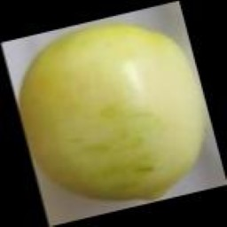
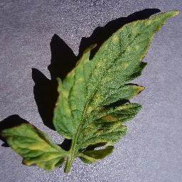
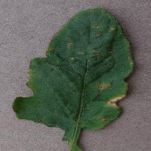
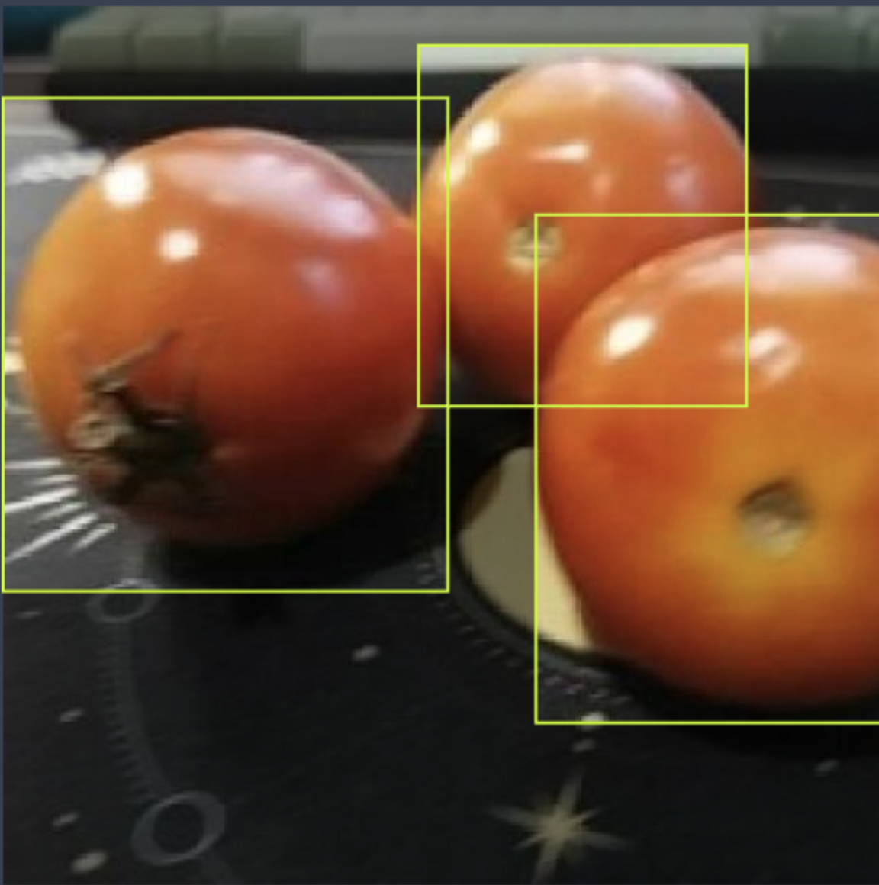
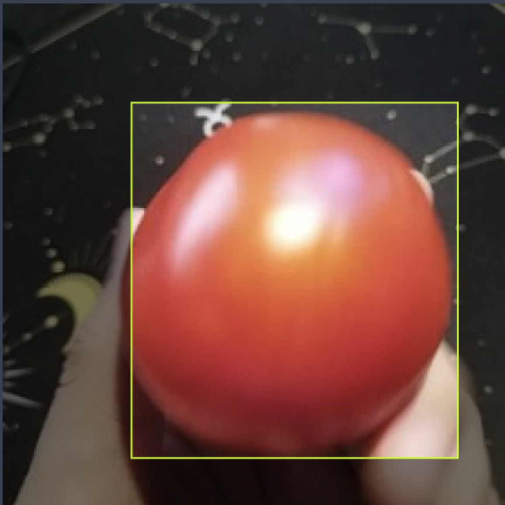
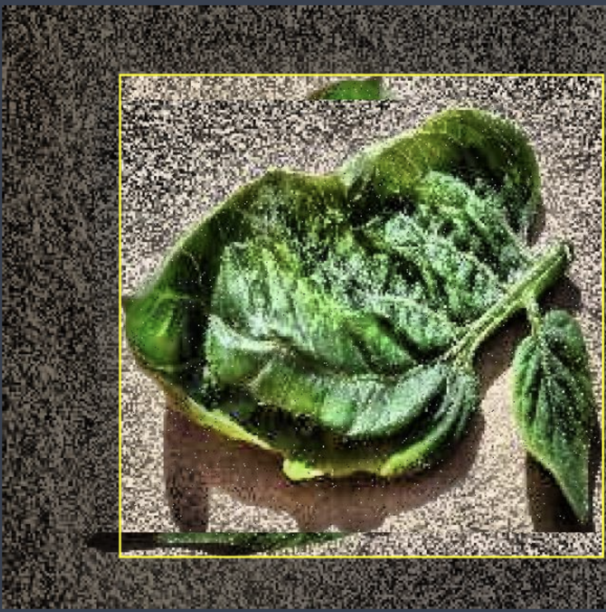
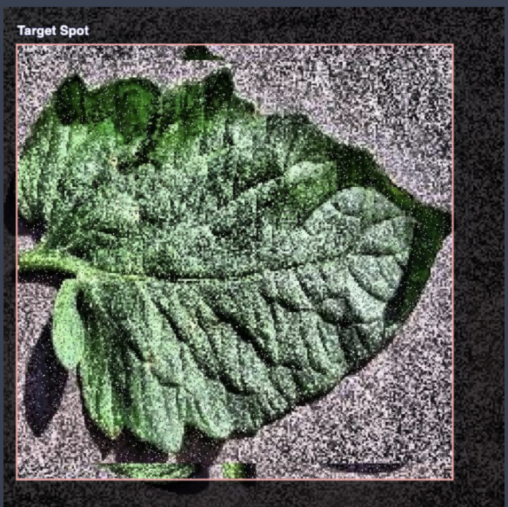

## Dataset

The dataset plays a crucial role in training and evaluating computer vision models for detecting tomato and tomato leaf problems. In this document, we will outline the details of the dataset used for tomato problem classification, leaf problem classification, tomato detection, and leaf detection.

## Tomato Problem Classification

### 1. Purpose
The purpose of this dataset is to classify different types of problems that can occur in tomatoes. By training a computer vision model on this dataset, we aim to accurately identify and classify various issues such as diseases, pests, and other abnormalities affecting tomatoes.

### 2. Classes
The dataset consists of multiple classes representing different tomato problems. Some examples of classes could include "healthy tomato," "early blight," "late blight," "tomato mosaic virus," "aphid infestation," and "mechanical damage."

### 3. Sample
A sample from the dataset would include images of tomatoes with their corresponding labels indicating the specific problem present. For instance, an image might be labeled as "early blight" if the tomato exhibits symptoms of that particular disease.

## Leaf Problem Classification

### 1. Purpose
The purpose of this dataset is to classify various leaf problems that can affect tomato plants. By training a computer vision model on this dataset, we aim to accurately identify and classify issues such as leaf diseases, nutrient deficiencies, and other abnormalities specific to tomato leaves.

### 2. Classes
The dataset includes multiple classes representing different leaf problems. Examples of classes could include "healthy leaf," "leaf spot," "yellowing leaves," "leaf curl," "leaf blight," and "nutrient deficiency."

### 3. Sample
A sample from the dataset would consist of images of tomato leaves along with their corresponding labels indicating the specific leaf problem present. For example, an image might be labeled as "leaf spot" if the leaf exhibits symptoms of that particular disease.

## Tomato Detection
[link](https://universe.roboflow.com/new-tomato-detection/tomato-detection-wb9kx)

### 1. Purpose
The purpose of this dataset is to train a computer vision model to detect the presence and location of tomatoes in images. This can be useful for automated harvesting, quality control, and yield estimation in agricultural applications.

### 2. Data Format
The dataset is annotated with bounding boxes around the tomatoes present in the images. Each image is accompanied by a corresponding annotation file that contains the coordinates of the bounding boxes.

### 3. Sample
A sample from the dataset would include images of tomato plants with bounding box annotations around the individual tomatoes. The annotation file would specify the coordinates of each bounding box.

## Leaf Detection
[link](https://universe.roboflow.com/unicorn-0qv1i/tomatoes-detection-opqa4)

### 1. Purpose
The purpose of this dataset is to train a computer vision model to detect the presence and location of tomato leaves in images. This can be useful for tasks such as leaf counting, leaf area estimation, and plant health assessment.

### 2. Data Format
Similar to tomato detection, the dataset is annotated with bounding boxes around the tomato leaves present in the images. Each image is accompanied by an annotation file containing the coordinates of the bounding boxes.

### 3. Sample
A sample from the dataset would consist of images of tomato plants with bounding box annotations around the individual leaves. The annotation file would provide the coordinates of each bounding box.

