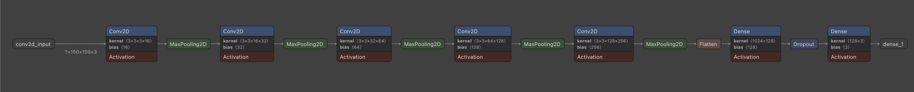
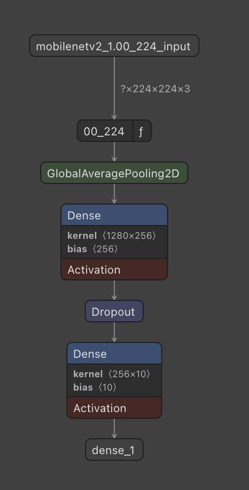
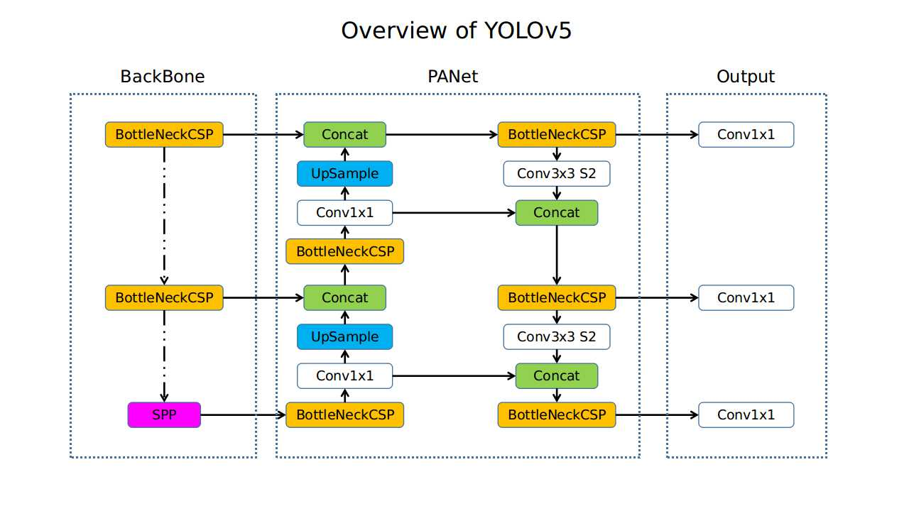

## Model

For the classification tasks related to tomato and tomato leaf problems, we employ a Convolutional Neural Network (CNN) architecture. CNNs are well-suited for image classification tasks as they can effectively learn and extract relevant features from input images.

### Tomato Problem Classification
In this task, we train a CNN model to classify different types of tomato problems. The CNN model takes input images of tomatoes and learns to identify and categorize the specific issues present. The architecture of the CNN consists of multiple convolutional layers, followed by pooling layers and fully connected layers. We utilize popular CNN architectures such as VGG, ResNet, or Inception, and fine-tune them on our dataset.

#### Architecture

### Leaf Problem Classification
Similar to tomato problem classification, we employ a CNN model for leaf problem classification. The CNN architecture is designed to analyze images of tomato leaves and classify them into various leaf problem categories. The model learns to recognize patterns and features indicative of different leaf issues. We utilize the same CNN architecture as in tomato problem classification, adapting it to the leaf dataset.

#### Architecture

## Detection

For the detection tasks related to tomatoes and leaves, we utilize the YOLOv5 (You Only Look Once) algorithm. YOLOv5 is a state-of-the-art object detection algorithm that provides accurate and efficient detection results.

### Tomato Detection
In tomato detection, we use the YOLOv5 algorithm to detect the presence and location of tomatoes in images. The YOLOv5 model is trained on annotated images, where bounding boxes are provided around the tomatoes. The model learns to identify and localize tomatoes within the image, enabling automated tomato detection in various applications.

### Leaf Detection
Similarly, for leaf detection, we employ the YOLOv5 algorithm to detect the presence and location of tomato leaves in images. The YOLOv5 model is trained on annotated images with bounding boxes around the leaves. By utilizing this model, we can accurately detect and localize tomato leaves, facilitating tasks such as leaf counting and plant health assessment.

By leveraging the power of CNNs for classification and YOLOv5 for detection, we can develop robust and accurate models for tomato and tomato leaf analysis, contributing to improved agricultural practices and crop management.

## Inference flow

Steps:
1. Detection: Image go into **tomato detection** and **leave detection** at the same time.
2. Object crop: After got boduing box from detection phase, system then crop object from the image and set to classification model
3. In classificaiton, tomato classificaiton and leave classification run at the same time (parallel). And these inference running in batching model (mutiple image at the same time)
4. Combine all output and visualize to bouding box